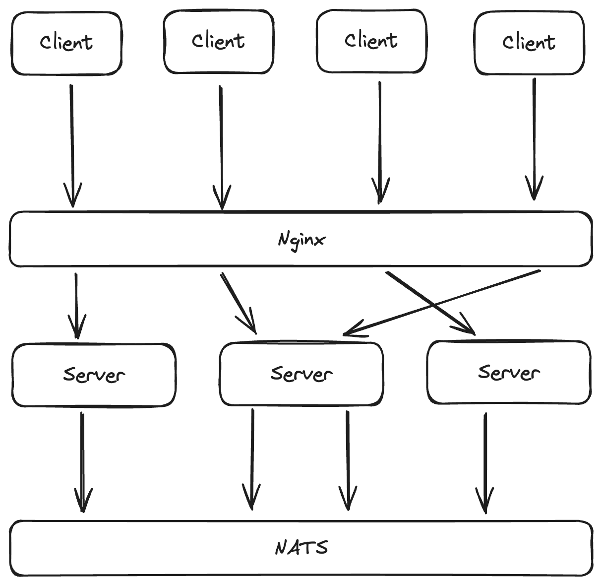

# Lightweight Char Room by Server-Sent Events & NATS

## What is Server-Sent Events?

[Server-Sent Events (SSE)](https://developer.mozilla.org/en-US/docs/Web/API/Server-sent_events/Using_server-sent_events) is a HTTP-based technology for continuously event publishing from server to client.

The advantages of SSE (compared with [WebSocket](https://developer.mozilla.org/en-US/docs/Web/API/WebSocket)):

1. SSE is one-way communication, which is easier to understand and simplifies the processing logic of both server and client
2. SSE has a standard API called `EventSource`:
   1. Easier to use
   2. Supported by most of the modern web browsers
   3. Built-in automatic reconnection mechanism
3. SSE is based on HTTP, which means:
   1. No need to handle protocol upgrade in WebSocket
   2. Easier to be integrated with Nginx 

## What is NATS?

[NATS](https://nats.io/) is a connective technology for adaptive edge & distributed systems, usually used as a message middleware.

NATS's built-in Pub/Sub mechanism provides an instant-data-propagation way for SSE connections on different machines.

## Architecture



## How to run?

### Server

```shell
docker compose up --build
```

### Client (Subscribe)

```shell
cd client
npm install
node index.js
```

### Client (Send Message)

```
POST 127.0.0.1/send
Content-Type: application/json

{
  "groupId": "1234",
  "sender": "Tony",
  "content": "hello~"
}
```